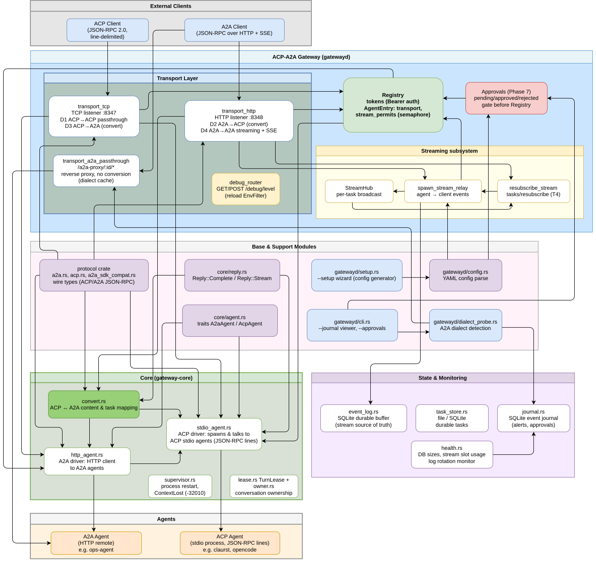

# ACP-A2A_gateway

A gateway layer between **ACP agents** (claurst, hermes, opencode) and **A2A clients** (external services, other agents). It listens on two ports (TCP + HTTP), serves four directions, issues tokens, and isolates conversations between clients. Includes streaming with a durable event buffer, a journal, health monitoring, and agent approval via CLI.

**Version:** 1.1.2 — release notes in [CHANGELOG.md](CHANGELOG.md). The version lives once in the root `Cargo.toml` (`[workspace.package]`) and is inherited by the `protocol`, `gateway-core` and `gatewayd` crates.

## Directions

| # | Incoming side | Agent | Transport | Port/route |
|---|---|---|---|---|
| 1 | ACP client | ACP (stdio) | TCP passthrough | `listen` |
| 2 | A2A client | A2A (HTTP) | HTTP reverse proxy, no conversion | `http_listen` → `/a2a-proxy/:id/*path` |
| 3 | ACP client | A2A (HTTP) | TCP, ACP→A2A converter | `listen` |
| 4 | A2A client | ACP (stdio) | HTTP, A2A→ACP converter | `http_listen` → `/agents/:id/rpc` |

Directions 2 and 4 support **streaming**: the HTTP client receives an SSE stream
of events (`text/event-stream`) up to the terminal `final: true`. Every event is
persisted to a durable `event_log` (SQLite), so a dropped client can resume via
`tasks/resubscribe`.

## A2A protocol strategy

Dialect strategy for the gateway and adapter (SDK v1.0 = base, Spec pre-1.0 =
fallback, ACP = deep fallback, ANP — out of scope):

- **EN:** [A2A-protocol-strategy-2026-en.summary.md](docs/A2A-protocol-strategy-2026-en.summary.md)
- **UA:** [A2A-protocol-strategy-2026-uk.summary.md](docs/A2A-protocol-strategy-2026-uk.summary.md)
- **RU:** [A2A-protocol-strategy-2026-ru.summary.md](docs/A2A-protocol-strategy-2026-ru.summary.md)

## Architecture diagram

Full gateway map (clients, transports, core, streaming, storage, base modules):



Source (drawio): [`docs/diagram_gateway.drawio.svg`](docs/diagram_gateway.drawio.svg)

## Structure

- `protocol/` — types (ACP + A2A), no business logic
- `core/` — engine: converters, sessions, owner, TaskStore, stdio/http agents, supervisor, reply
- `gatewayd/` — binary: config, Registry, TCP/HTTP transports, streaming (SSE relay, StreamHub, resubscribe), event_log, journal, health, approvals, background task sweep

## Build and tests

```bash
cargo build --workspace
cargo check --workspace --all-targets
cargo test --workspace          # 155 tests (unit + integration + streaming T1–T10)
cargo clippy --workspace --all-targets -- -D warnings
```

`Cargo.lock` is committed (decision 2026-08-19) — dependencies are pinned and
must not drift from `Cargo.toml` on CI.

## Run

```bash
cp config.example.yaml config.yaml   # adjust tokens, agents, public_url
./target/debug/gatewayd config.yaml
```

- TCP `listen` (default `0.0.0.0:8347`): first line is the handshake `{"token":"...","agent_id":"..."}`.
- HTTP `http_listen` (default `0.0.0.0:8348`): Bearer token in `Authorization`.
- `public_url` — external gateway address, goes into `AgentCard.url` (`agent.json`).
- Background cleanup of finished tasks: `task_retention_days` (default 7), hourly.

### Config sections

| Section | Purpose |
|---|---|
| `streaming:` (per agent) | `max_concurrent_streams`, `first_chunk_timeout_secs`, `idle_chunk_timeout_secs` |
| `event_log:` | durable stream event buffer (SQLite) — source of truth for `tasks/resubscribe` |
| `task_store:` | durable task storage (SQLite); without the section — file-based storage |
| `journal:` | user-facing durable journal (health alerts, stream drops, approvals), retention_days |
| `health:` | periodic DB size and stream slot usage checks |
| `approvals:` | human approval of agents (pending/approved/rejected) |
| `logging:` | level/output, file rotation, `compress_rotated`, `debug_ttl_minutes` |

### Logging and diagnostics (Part 4)

```yaml
logging:
  level: "info"              # info | debug | trace | warn | error | off
  output: "stdout"           # stdout | file | both
  debug_ttl_minutes: 60      # lifetime of a temporarily raised level
  file:
    path: "/var/log/acp-a2a-gateway/gateway.log"
    max_file_size_mb: 100
    max_files: 10
    max_total_size_mb: 1000
    compress_rotated: true
```

- `level: "off"` — emergency valve: fully disables the filter (startup warning is printed to stderr before disabling).
- Rotation: `tracing-appender` + an hourly background directory sweep (actually deletes oldest files and gzips when `max_total_size_mb` is exceeded).
- **Hot level switch without restart**:
  - `GET /debug/level` — current level;
  - `POST /debug/level` with body `{"level":"debug"}` and `Authorization: Bearer <token>` — set the level;
  - `debug|trace` levels auto-revert to `info` after `debug_ttl_minutes`.

## CLI commands (Rust module, no external sqlite3)

- `gatewayd --journal [--limit N] [--level info|warn|error] [--category NAME] [--since 10m|6h|1d|2w|1mo] [--db PATH]`
  — view the durable journal (health alerts, stream drops, approvals) as an ASCII table.
- `gatewayd --approvals` — agent statuses (pending/approved/rejected) + fingerprint.
- `gatewayd --approve <name>` / `gatewayd --reject <name>` — human approval of agents
  (`approvals:` config section; an unapproved agent is not served and is logged to the journal).
- `gatewayd --setup` — interactive config generation wizard.

Full guide: [`docs/06-gateway-guide.md`](docs/06-gateway-guide.md) (RU) · [`docs/06-gateway-guide-en.md`](docs/06-gateway-guide-en.md) (EN) · [`docs/06-gateway-guide-uk.md`](docs/06-gateway-guide-uk.md) (UK).

## Streaming (summary)

- Directions 2/4 return SSE; `spawn_stream_relay` persists events to `event_log`
  and publishes them to the per-task `StreamHub`.
- `tasks/resubscribe` — durable subscription: the client gets history from `event_log`,
  then live events from `StreamHub` (dedup by `seq`).
- Details and checklist: [`docs/streaming-roadmap-checklist.md`](docs/streaming-roadmap-checklist.md).
